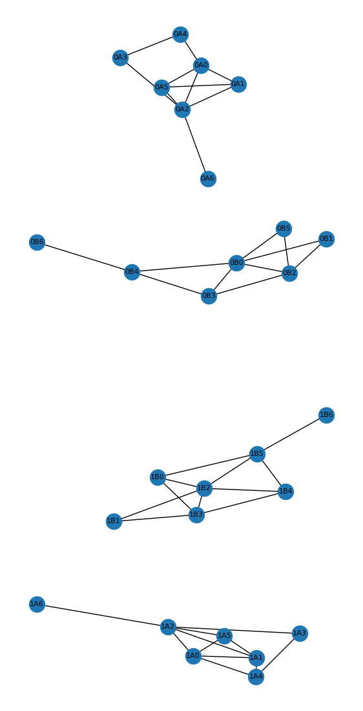
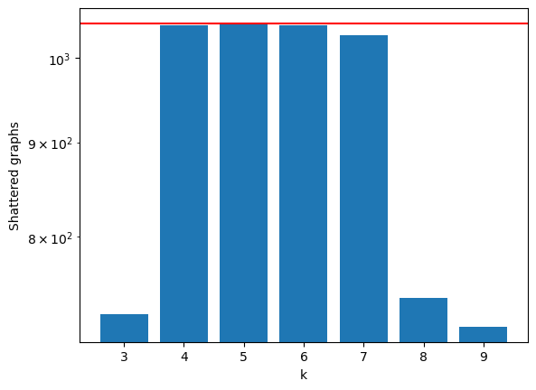
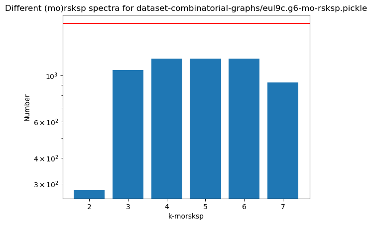
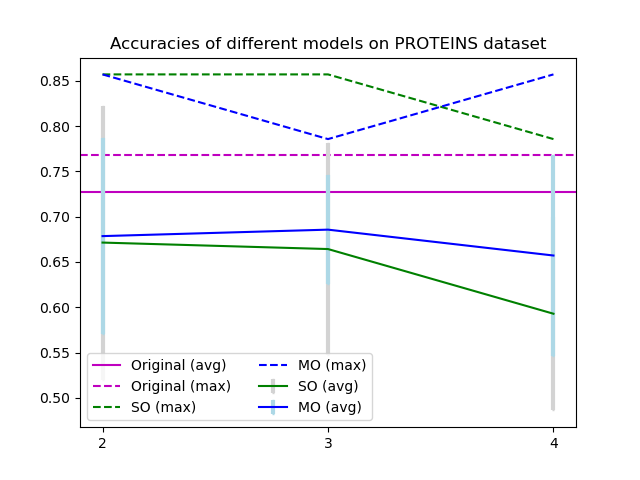
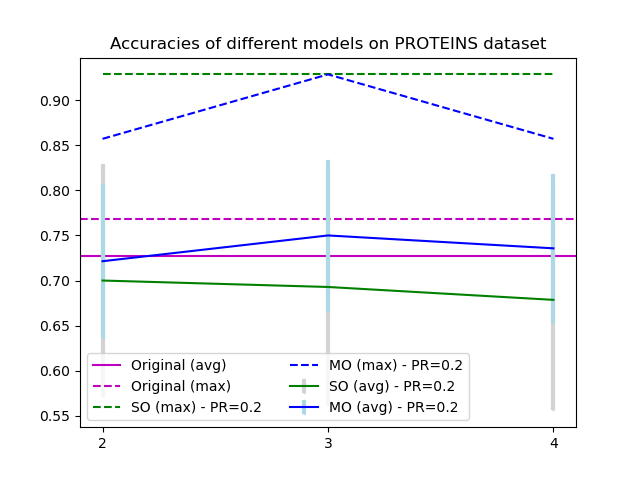
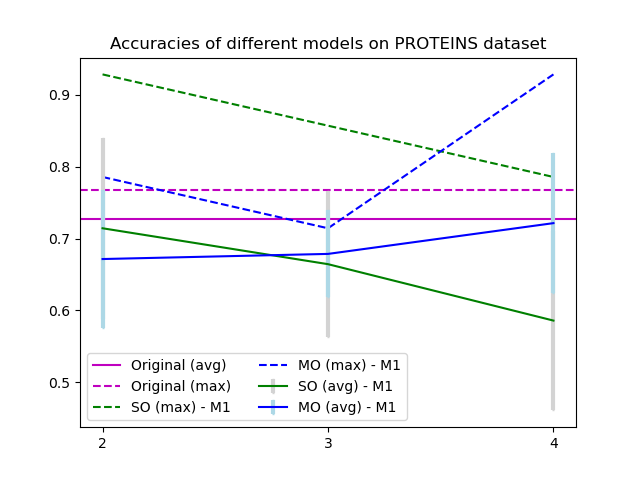

# Experiments

## Discriminating important graphs
I grafi difficili da discriminare normalmente.

## Regression QM7
Stessa cosa che abbiamo sull'extended abstract

## (Notebook) Exp-on-graphs
Questa cosa si puo rifare con TUTTI i gruppi di grafi. Nel file `Exp-on-graphs.ipynb` ci sono piu esperimenti interessanti.
*Note*: all these experiments can be performed for all the possible and imaginable datasets of graphs. Examples are:
- all undirected graphs of 2,3,4,5,6,7 nodes
- euler graphs (for various n)
- chordal graphs (for various n)
- planar graphs (for various n)
- etc..

### EXP: Do we gain distinguishing capabilities increasing k for the k-reduced-skew-spectrum?
Qua facciamo vedere che ci sono dei grafi che distinguiamo aumentando k. I lottery ticket sono questi. Questo e'un esempio. 
Nel caso di atlas7, we have 2 lottery tickets, i.e. nodes with a split at depth k>3 


```
{'1orbit-0-corre-dict': 712,
 '1orbit-2-corre-dict': 518,
 '1orbit-3-corre-dict': 4,
 '1orbit-4-corre-dict': 0,
 '1orbit-5-corre-dict': 0,
 '1orbit-6-corre-dict': 0,
 '1orbit-7-corre-dict': 0,
 '1orbit-8-corre-dict': 0}
The number of nodes is  4868
The number of graphs is  1044


The lottery tickets are:
[(3, 417, 419), (3, 555, 556)]
```



TODO: abbiamo capito che per atlas-undirected-7nodes (che ha 1044 grafi non-isomoprhic) un possibile valore per 
` [726, 1042, 1043, 1041, 1029]`. Questo assuming che gli skew-spectra sono fatti con enough digits of precision, e che i due algoritmi (skew2table and table2tree) behind the data strucutres per generare questi numeri sono corretti.

Questo il grafico per atlas7 delle cose fatte assieme. 



### EXP: Comparing "distinguishing capabilities" between different datasets
Si puo prendere i dataset differenti, generare il grafico (x axis = skew-spectrum and y axis numero di different morsksp.) e vedere per quali grafici siamo "meglio". Come abbiamo visto, su alcuni grafi il morkspsp riesce a distinguere quasi tutto, mentre con altri perdiamo un sacco di cosa, no matter what k is. 
Per esempio:





## Neural Networks (HGP-SL-extended)
Qua ci sta il codice di una NN che puo essere trainata su dataset differenti. 
I bashozzi fanno un po di calcolo di medie, varianze e maximum per i different dataset (e.g. èxperiments-NC1.sh`) 

Il codice e' diviso in `main.py` e `models.py` per le cose originali, e le nostre modifiche sono dentro `extended-models.py` and `extended-main.py`. 

Questo codice puo ricalcolare gli skew-spectra on the fly, ma puo anche fare dump o usare skew-spectra che arrivano da HPC machines. 
L'idea della classe `Model` e'che facciamo da una parte la convoluzione dei grafi (as standard in ML) ma poi ci appiccichiamo come dei nabbi le features dello skew-spectrum. 
La conclusione e'che questa cosa va meglio se prendi i modelli migliori, i.e. not on average. 
However, ci sembra che abbiano fatto cosi anche nel paper che stiamo usando per le comparison: hanno riportato i modelli che generalizzano MEGLIO e non l'average generalization accuracy.  

Su laptop possiamo fare grafi fino a 25 nodi, ma con HPC machines ero arrivato fino a 50/51.







#### Split e validation test set 
random_split comes from from torch.utils.data import random_split


```
num_training = int(len(dataset) * 0.8)
num_val = int(len(dataset) * 0.1)
num_test = len(dataset) - (num_training + num_val)
training_set, validation_set, test_set = random_split(dataset, [num_training, num_val, num_test])

```


### PROTEINS e'fatto con n=59


## ALGORITHMO
Def nome nodo: 
(k, [id, id, ...])
k = k=correlation, 
id = id di grafi con quel skewthign

per ogni nodo a depth k=3 o 4 (quella che ci interessa con 1043 nodi) vediamo il nome del nodo 

tmp_id_interesting_graph_ = 0
tmp_id_interesting_graph = 0
for g in G_dfs:
   if g starts with 3 # g[0]==3:
        if len(g.name) > 2:
              print (g.name) 
              tmp_id_interesting_graph = g.name[1]
              tmp_id_interesting_graph_ = g.name[2]


print(raw_dataset[0][tmp_id_interesting_graph])   
