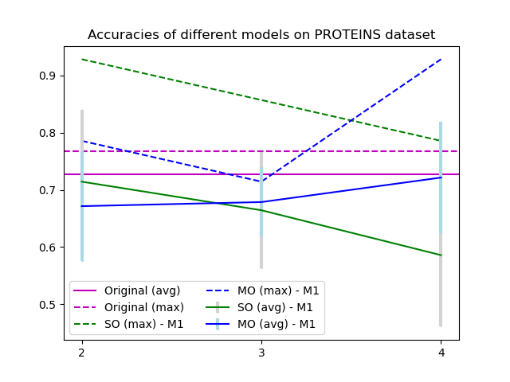

# Experiments on multi-orbit reduced skew spectrum for group-theoretical ML


We have the following datasets:
- `dataset-random-graphs`: The k-reduced-skew-spectra of Erdős–Rényi graphs.
- `dataset-simple-graphs`: some simple graphs downloaded from the link below
- `dataset-all-graphs`: all directed and undirected graph for small (very small :) ) n

We have the following files to create and process datasets:

- `generate-random-dataset.py`: generate the datasets in  `dataset-random-graphs` directory and the dataset for `EXP-Atlas-undirected
- `generate_all_graphs`: folder with HPC code to generate in parallel(!) all directed graphs, eventually skipping some.
- `fromsparse.py:` convert g6 graphs into netnworkx->numpy and gerate k-reduced-skew-spectra


We have the following experiments 
- `EXP-on-graphs.ipynb`: the experiments with all undirected graphs of n=7 nodes
- `EXP-discriminating-important-graphs`: our 3-reduced-skew-spectra can distringuish two important graphs :)
- `EXP-new-QM7-regression.ipynb`: Some examples on how the k-reduced-skew spectra improves the regression task on QM7-datasets

We have the following experimeents with Neural Networks:
- `HGP-SL-extended`: from https://github.com/cszhangzhen/HGP-SL

##### Useful links 
- http://users.cecs.anu.edu.au/%7Ebdm/data/graphs.html

pip install torch_geometric==1.7.2


# Experiments 


## 1 EXP-new-QM7-regression.ipynb
This is the same content as in the extended abstract.

---

## 2 EXP-on-graphs-generate-shattering-plots.ipynb
All these experiments can be repeated for **any** group of graphs. In the file `Exp-on-graphs.ipynb`, you will find several interesting experiments.

*Note*: You can perform these experiments on any imaginable graph dataset. For example:
- All undirected graphs with 2, 3, 4, 5, 6, 7 nodes  
- Euler graphs (for various *n*)  
- Chordal graphs (for various *n*)  
- Planar graphs (for various *n*)  
- etc.

### Quesiton: Do we gain more distinguishing power by increasing *k* for the k-reduced-skew-spectrum?
Here we show that there are graphs that become distinguishable only when we increase *k*. We call these "lottery tickets." For example, in the case of `atlas7`, we found 2 lottery tickets, i.e., nodes that split at depth `k>3`:

```
{'1orbit-0-corre-dict': 712,
 '1orbit-2-corre-dict': 518,
 '1orbit-3-corre-dict': 4,
 '1orbit-4-corre-dict': 0,
 '1orbit-5-corre-dict': 0,
 '1orbit-6-corre-dict': 0,
 '1orbit-7-corre-dict': 0,
 '1orbit-8-corre-dict': 0}

The number of nodes is 4868
The number of graphs is 1044

The lottery tickets are:
[(3, 417, 419), (3, 555, 556)]
```


**TODO**: We realized that for `atlas-undirected-7nodes` (which has 1044 non-isomorphic graphs), a possible value for `[726, 1042, 1043, 1041, 1029]` works. This assumes the skew-spectra are generated with enough precision, and that the two algorithms (`skew2table` and `table2tree`) used behind the data structures produce correct numbers.

Below is the figure for `atlas7` from the experiments we did together:  


---

### Quesiton: How does it compare the morsksp across different datasets
We can take different datasets, generate a plot (x-axis = skew-spectrum, y-axis = number of different morsKSP), and see where we perform “better.” As we found, for some graphs, morsKSP can distinguish almost everything, while for others it loses a lot of information, no matter what *k* is.

For example:


---

## 3 Morksp as additional feature in neural networks (HGP-SL-extended)
This folder contains the code for a neural network that can be trained on different datasets. The `bash` scripts compute averages, variances, and maximum values for the various datasets (for instance, `experiments-NC1.sh`).

The code is split into `main.py` and `models.py` for the original parts. Our modifications are in `extended-models.py` and `extended-main.py`. 

This code can recompute skew-spectra on the fly, but it can also dump or reuse skew-spectra from HPC machines. The idea of the `Model` class is to perform standard graph convolution in ML while also adding skew-spectrum features. We observed that this approach performs better if we pick the best models (i.e., those that generalize best), which matches the approach in the paper we’re comparing against—they report models that generalize better, rather than average performance.

On a laptop, we can process graphs up to 25 nodes; on HPC machines, we reached up to 50–51 nodes.

  
  


### Split and validation test set
```python
random_split comes from torch.utils.data import random_split

num_training = int(len(dataset) * 0.8)
num_val = int(len(dataset) * 0.1)
num_test = len(dataset) - (num_training + num_val)

training_set, validation_set, test_set = random_split(dataset, [num_training, num_val, num_test])
```

### Note on the PROTEINS dataset
For PROTEINS, we used `n=59` nodes.

---

# ALGORITHM
**Node name definition**: `(k, [id, id, …])`  
- `k`: correlation level  
- `id`: IDs of graphs with that skew-thing

For each node at depth `k=3` or `k=4` (the ones we care about with 1043 nodes), we get the node name.

```python
tmp_id_interesting_graph_ = 0
tmp_id_interesting_graph = 0
for g in G_dfs:
    if g[0] == 3:
        if len(g.name) > 2:
            print(g.name)
            tmp_id_interesting_graph = g.name[1]
            tmp_id_interesting_graph_ = g.name[2]

print(raw_dataset[0][tmp_id_interesting_graph])  
```

# WIP
- Experiments with proteins (MO). Download them locally from the NUS server where they are being computed.
- Make ENZYMES work: debug the two `forward()` functions to ensure the same tensor shape and batch size.
- Test that the format for the `morsksp` export is correct locally and can be read properly.
- Experiment with all graphs downloaded from the website.